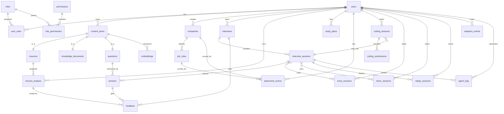

## InterviewGPT Database Design (PostgreSQL)

This document defines the **normalized** PostgreSQL schema for InterviewGPT.

### Principles

- **PostgreSQL is the system of record** for all core entities.
- **Normalized by default** (3NF for core objects). JSONB is used only for *variable-shape payloads* (model outputs, telemetry properties, rubrics/breakdowns), while relationships remain relational.
- **Append-only logs/events** (`agent_logs`, `analytics_events`) for observability and replayable history.
- **No polymorphic foreign keys**: content objects share a proper supertype (`content_items`) with 1:1 subtype tables.

---

### ER Diagram (logical)



---

### Tables, relationships, indexes, and constraints

#### Extensions

- `citext` for case-insensitive unique emails
- `pgcrypto` for `gen_random_uuid()`

#### Domain overview

- **Identity & authorization**: `users`, `roles`, `permissions`, `user_roles`, `role_permissions`
- **Content/RAG**: `content_items`, `resumes`, `knowledge_documents`, `embeddings`
- **Interviews**: `interviews`, `interview_sessions`, `questions`, `answers`, `feedback`
- **Coding**: `coding_sessions`, `coding_submissions`
- **Career planning**: `companies`, `job_roles`, `study_plans`, `placement_scores`
- **Replay & telemetry**: `replay_sessions`, `analytics_events`, `agent_logs`
- **Multimodal**: `voice_sessions`, `vision_sessions`

---

### PostgreSQL DDL (complete)

> Notes:
> - All timestamps are `timestamptz`.
> - UUID primary keys are generated in Postgres via `gen_random_uuid()`.
> - JSONB columns are used for variable model outputs and event properties, not for core relationships.

```sql
-- Extensions
create extension if not exists citext;
create extension if not exists pgcrypto;

-- Enums
do $$ begin
  create type content_type as enum ('resume','knowledge_document','question');
  create type interview_status as enum ('draft','scheduled','in_progress','completed','archived');
  create type session_status as enum ('created','running','ended','aborted');
  create type submission_status as enum ('queued','running','passed','failed','error');
exception when duplicate_object then null; end $$;

-- USERS
create table users (
  id uuid primary key default gen_random_uuid(),
  email citext not null unique,
  password_hash text, -- nullable for oauth-only accounts
  full_name text,
  is_active boolean not null default true,
  last_login_at timestamptz,
  created_at timestamptz not null default now(),
  updated_at timestamptz not null default now()
);
create index ix_users_created_at on users (created_at);

-- ROLES / PERMISSIONS
create table roles (
  id uuid primary key default gen_random_uuid(),
  name text not null unique,
  description text,
  created_at timestamptz not null default now()
);

create table permissions (
  id uuid primary key default gen_random_uuid(),
  code text not null unique,
  description text,
  created_at timestamptz not null default now()
);

create table user_roles (
  user_id uuid not null references users(id) on delete cascade,
  role_id uuid not null references roles(id) on delete cascade,
  assigned_at timestamptz not null default now(),
  primary key (user_id, role_id)
);
create index ix_user_roles_role_id on user_roles (role_id);

create table role_permissions (
  role_id uuid not null references roles(id) on delete cascade,
  permission_id uuid not null references permissions(id) on delete cascade,
  granted_at timestamptz not null default now(),
  primary key (role_id, permission_id)
);
create index ix_role_permissions_permission_id on role_permissions (permission_id);

-- CONTENT SUPERTYPE
create table content_items (
  id uuid primary key default gen_random_uuid(),
  type content_type not null,
  owner_user_id uuid references users(id) on delete set null,
  title text,
  source_uri text,
  checksum_sha256 text,
  metadata jsonb not null default '{}'::jsonb,
  created_at timestamptz not null default now(),
  updated_at timestamptz not null default now()
);
create index ix_content_items_owner_type_created on content_items (owner_user_id, type, created_at desc);
create index ix_content_items_metadata_gin on content_items using gin (metadata);

-- RESUMES (subtype)
create table resumes (
  content_item_id uuid primary key references content_items(id) on delete cascade,
  raw_text text,
  structured jsonb not null default '{}'::jsonb,
  original_filename text,
  mime_type text,
  file_size_bytes bigint check (file_size_bytes is null or file_size_bytes >= 0)
);

-- RESUME ANALYSIS
create table resume_analysis (
  id uuid primary key default gen_random_uuid(),
  user_id uuid not null references users(id) on delete cascade,
  resume_content_item_id uuid not null references resumes(content_item_id) on delete cascade,
  model_name text,
  prompt_version text,
  result jsonb not null,
  score numeric(5,2) check (score is null or (score >= 0 and score <= 100)),
  created_at timestamptz not null default now()
);
create index ix_resume_analysis_user_created on resume_analysis (user_id, created_at desc);
create index ix_resume_analysis_resume_created on resume_analysis (resume_content_item_id, created_at desc);

-- COMPANIES / JOB ROLES
create table companies (
  id uuid primary key default gen_random_uuid(),
  created_by_user_id uuid references users(id) on delete set null,
  name text not null,
  website text,
  industry text,
  metadata jsonb not null default '{}'::jsonb,
  created_at timestamptz not null default now(),
  unique (name)
);

create table job_roles (
  id uuid primary key default gen_random_uuid(),
  company_id uuid references companies(id) on delete set null,
  title text not null,
  level text,
  description text,
  skills jsonb not null default '[]'::jsonb,
  created_at timestamptz not null default now(),
  unique (company_id, title, level)
);
create index ix_job_roles_company on job_roles (company_id);

-- QUESTIONS (subtype)
create table questions (
  content_item_id uuid primary key references content_items(id) on delete cascade,
  difficulty int check (difficulty between 1 and 5),
  category text,
  tags text[] not null default '{}',
  prompt text not null,
  rubric jsonb not null default '{}'::jsonb
);
create index ix_questions_tags_gin on questions using gin (tags);
create index ix_questions_category_diff on questions (category, difficulty);

-- INTERVIEWS / SESSIONS
create table interviews (
  id uuid primary key default gen_random_uuid(),
  user_id uuid not null references users(id) on delete cascade,
  company_id uuid references companies(id) on delete set null,
  job_role_id uuid references job_roles(id) on delete set null,
  title text,
  status interview_status not null default 'draft',
  scheduled_for timestamptz,
  context jsonb not null default '{}'::jsonb,
  created_at timestamptz not null default now(),
  updated_at timestamptz not null default now()
);
create index ix_interviews_user_status_created on interviews (user_id, status, created_at desc);
create index ix_interviews_company_role on interviews (company_id, job_role_id);

create table interview_sessions (
  id uuid primary key default gen_random_uuid(),
  interview_id uuid not null references interviews(id) on delete cascade,
  status session_status not null default 'created',
  started_at timestamptz,
  ended_at timestamptz,
  transcript text,
  session_context jsonb not null default '{}'::jsonb,
  created_at timestamptz not null default now(),
  check (ended_at is null or started_at is null or ended_at >= started_at)
);
create index ix_interview_sessions_interview_created on interview_sessions (interview_id, created_at desc);
create index ix_interview_sessions_status on interview_sessions (status);

-- ANSWERS
create table answers (
  id uuid primary key default gen_random_uuid(),
  interview_session_id uuid not null references interview_sessions(id) on delete cascade,
  question_content_item_id uuid not null references questions(content_item_id) on delete restrict,
  answer_text text,
  answer_json jsonb not null default '{}'::jsonb,
  tokens_used int check (tokens_used is null or tokens_used >= 0),
  created_at timestamptz not null default now(),
  unique (interview_session_id, question_content_item_id)
);
create index ix_answers_session_created on answers (interview_session_id, created_at);
create index ix_answers_question on answers (question_content_item_id);

-- FEEDBACK (targets: answer OR interview OR resume_analysis)
create table feedback (
  id uuid primary key default gen_random_uuid(),
  user_id uuid references users(id) on delete set null, -- author; nullable for system feedback
  answer_id uuid references answers(id) on delete cascade,
  interview_id uuid references interviews(id) on delete cascade,
  resume_analysis_id uuid references resume_analysis(id) on delete cascade,
  rating int check (rating between 1 and 5),
  feedback_text text,
  rubric_scores jsonb not null default '{}'::jsonb,
  created_at timestamptz not null default now(),
  check (
    (answer_id is not null)::int +
    (interview_id is not null)::int +
    (resume_analysis_id is not null)::int = 1
  )
);
create index ix_feedback_answer on feedback (answer_id);
create index ix_feedback_interview on feedback (interview_id);
create index ix_feedback_resume_analysis on feedback (resume_analysis_id);

-- CODING
create table coding_sessions (
  id uuid primary key default gen_random_uuid(),
  user_id uuid not null references users(id) on delete cascade,
  interview_session_id uuid references interview_sessions(id) on delete set null,
  language text not null,
  prompt text,
  started_at timestamptz not null default now(),
  ended_at timestamptz,
  metadata jsonb not null default '{}'::jsonb,
  check (ended_at is null or ended_at >= started_at)
);
create index ix_coding_sessions_user_started on coding_sessions (user_id, started_at desc);
create index ix_coding_sessions_interview_session on coding_sessions (interview_session_id);

create table coding_submissions (
  id uuid primary key default gen_random_uuid(),
  coding_session_id uuid not null references coding_sessions(id) on delete cascade,
  attempt int not null,
  code text not null,
  status submission_status not null default 'queued',
  stdout text,
  stderr text,
  runtime_ms int check (runtime_ms is null or runtime_ms >= 0),
  score numeric(5,2) check (score is null or (score >= 0 and score <= 100)),
  created_at timestamptz not null default now(),
  unique (coding_session_id, attempt)
);
create index ix_coding_submissions_session_created on coding_submissions (coding_session_id, created_at desc);

-- ANALYTICS (append-only events)
create table analytics_events (
  id uuid primary key default gen_random_uuid(),
  user_id uuid references users(id) on delete set null,
  session_id uuid, -- app/web session identifier (not FK by design)
  event_name text not null,
  event_time timestamptz not null default now(),
  properties jsonb not null default '{}'::jsonb
);
create index ix_analytics_events_name_time on analytics_events (event_name, event_time desc);
create index ix_analytics_events_user_time on analytics_events (user_id, event_time desc);
create index ix_analytics_events_props_gin on analytics_events using gin (properties);

-- REPLAY SESSIONS
create table replay_sessions (
  id uuid primary key default gen_random_uuid(),
  user_id uuid not null references users(id) on delete cascade,
  interview_session_id uuid not null references interview_sessions(id) on delete cascade,
  title text,
  artifacts jsonb not null default '{}'::jsonb,
  created_at timestamptz not null default now()
);
create index ix_replay_sessions_user_created on replay_sessions (user_id, created_at desc);
create index ix_replay_sessions_session on replay_sessions (interview_session_id);

-- KNOWLEDGE DOCS (subtype)
create table knowledge_documents (
  content_item_id uuid primary key references content_items(id) on delete cascade,
  body text not null,
  source_type text,
  tags text[] not null default '{}'
);
create index ix_knowledge_docs_tags_gin on knowledge_documents using gin (tags);

-- EMBEDDINGS
create table embeddings (
  id uuid primary key default gen_random_uuid(),
  content_item_id uuid not null references content_items(id) on delete cascade,
  embedding_model text not null,
  vector_dim int not null check (vector_dim > 0),
  embedding float4[] not null,
  chunk_index int not null default 0,
  chunk_text text,
  created_at timestamptz not null default now(),
  unique (content_item_id, embedding_model, chunk_index),
  check (array_length(embedding, 1) = vector_dim)
);
create index ix_embeddings_content_model on embeddings (content_item_id, embedding_model);

-- AGENT LOGS (append-only)
create table agent_logs (
  id uuid primary key default gen_random_uuid(),
  user_id uuid references users(id) on delete set null,
  interview_session_id uuid references interview_sessions(id) on delete set null,
  agent_name text not null,
  event_type text not null,
  payload jsonb not null default '{}'::jsonb,
  created_at timestamptz not null default now()
);
create index ix_agent_logs_user_time on agent_logs (user_id, created_at desc);
create index ix_agent_logs_session_time on agent_logs (interview_session_id, created_at desc);
create index ix_agent_logs_payload_gin on agent_logs using gin (payload);

-- STUDY PLANS
create table study_plans (
  id uuid primary key default gen_random_uuid(),
  user_id uuid not null references users(id) on delete cascade,
  job_role_id uuid references job_roles(id) on delete set null,
  title text not null,
  plan jsonb not null,
  starts_on date,
  ends_on date,
  created_at timestamptz not null default now(),
  check (ends_on is null or starts_on is null or ends_on >= starts_on)
);
create index ix_study_plans_user_created on study_plans (user_id, created_at desc);

-- PLACEMENT SCORES
create table placement_scores (
  id uuid primary key default gen_random_uuid(),
  user_id uuid not null references users(id) on delete cascade,
  company_id uuid references companies(id) on delete set null,
  job_role_id uuid references job_roles(id) on delete set null,
  score numeric(5,2) not null check (score >= 0 and score <= 100),
  breakdown jsonb not null default '{}'::jsonb,
  computed_at timestamptz not null default now()
);
create index ix_placement_scores_user_time on placement_scores (user_id, computed_at desc);
create index ix_placement_scores_role on placement_scores (job_role_id);

-- VOICE / VISION SESSIONS
create table voice_sessions (
  id uuid primary key default gen_random_uuid(),
  user_id uuid not null references users(id) on delete cascade,
  interview_session_id uuid references interview_sessions(id) on delete set null,
  provider text,
  locale text,
  started_at timestamptz not null default now(),
  ended_at timestamptz,
  metadata jsonb not null default '{}'::jsonb,
  check (ended_at is null or ended_at >= started_at)
);
create index ix_voice_sessions_user_started on voice_sessions (user_id, started_at desc);

create table vision_sessions (
  id uuid primary key default gen_random_uuid(),
  user_id uuid not null references users(id) on delete cascade,
  interview_session_id uuid references interview_sessions(id) on delete set null,
  provider text,
  started_at timestamptz not null default now(),
  ended_at timestamptz,
  metadata jsonb not null default '{}'::jsonb,
  check (ended_at is null or ended_at >= started_at)
);
create index ix_vision_sessions_user_started on vision_sessions (user_id, started_at desc);
```

---

### Indexing summary (why these exist)

- **Foreign-key join performance**: all major FK columns are indexed (either directly or via composite indexes).
- **User timelines**: composite indexes like `(user_id, created_at desc)` on high-read history tables.
- **Flexible filters**: GIN indexes on JSONB (`content_items.metadata`, `agent_logs.payload`, `analytics_events.properties`) and tag arrays (`questions.tags`, `knowledge_documents.tags`).

---

### Constraints summary (data integrity)

- **Users**
  - `users.email` is unique (case-insensitive with `citext`).
- **Answers**
  - One answer per question per session: `unique(interview_session_id, question_content_item_id)`.
- **Coding submissions**
  - Attempts are unique per coding session: `unique(coding_session_id, attempt)`.
- **Feedback**
  - Exactly one target must be set (`answer_id` xor `interview_id` xor `resume_analysis_id`).
- **Embeddings**
  - Enforces `array_length(embedding) == vector_dim` and uniqueness per chunk.
- **Time ordering**
  - Any `ended_at` must be \( \ge \) `started_at`.

---

### SQLAlchemy models (documentation-only)

The application should map these tables using SQLAlchemy 2.0 typed declarative models:

- **M:N association tables**: `user_roles`, `role_permissions`
- **Content supertype/subtypes**:
  - `ContentItem` (supertype)
  - `Resume`, `KnowledgeDocument`, `Question` (1:1 subtype tables keyed by `content_item_id`)
- **Normalized references**:
  - `Answer.question_content_item_id → questions.content_item_id` (not to `content_items` directly)
  - `ResumeAnalysis.resume_content_item_id → resumes.content_item_id`

> The exact model class code is intentionally kept out of this document to avoid introducing backend implementation prematurely; the schema above is the source of truth.

---

### Alembic migration strategy

#### Baseline

- **Revision `0001_init`**:
  - Create extensions (`citext`, `pgcrypto`)
  - Create enums
  - Create tables in FK-safe order
  - Create indexes (including GIN)

#### Safe evolution rules

- **Additive-first changes**: add new columns as nullable → backfill → enforce `NOT NULL` in a later revision.
- **Large-table indexes**: create with `CONCURRENTLY` in a dedicated migration (and configure Alembic to allow non-transactional DDL for that revision).
- **Enums**: only add values in-place (`ALTER TYPE ... ADD VALUE`); avoid renames/removals without a planned multi-step migration.
- **Append-only logs**: treat `agent_logs` and `analytics_events` as immutable; corrections happen via compensating events, not updates.

#### Growth options (later)

- If `analytics_events` / `agent_logs` becomes very large, migrate to **monthly range partitions** (kept as a separate operational plan).

